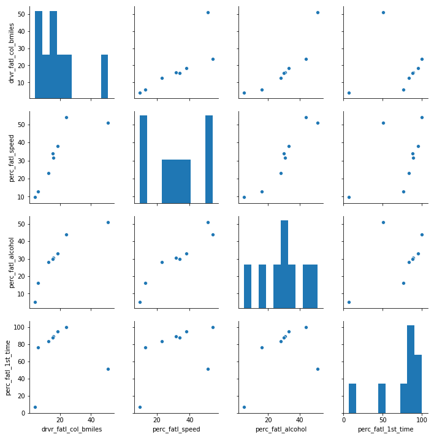
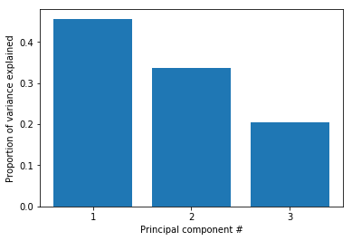
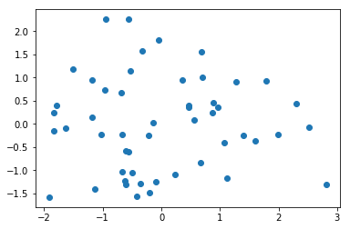
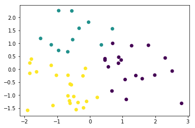

# Reducing-Traffic-Mortality-in-the-USA


We analyze data collected by the National Highway Traffic Safety Administration and the National Association of Insurance Commissioners to wrangle, plot, dimensionally reduce and cluster data to make an attempt to find patterns and help reduce Traffic Mortality in USA. :vertical_traffic_light: :car: :truck: :blue_car: 
### Datasets

:file_folder: there are two datasets : **miles-driven.csv** , **road-accidents.csv**

#### Install the requirements

> - Install the pandas library using command pip install pandas.
> - Install the numpy library using command pip install numpy.

```import pandas as pd```

```import numpy as np```

```import matplotlib.pyplot as plt```

:file_folder: Our dataset **road-accidents.csv** show this :


|    | state      |   drvr_fatl_col_bmiles |   perc_fatl_speed |   perc_fatl_alcohol |   perc_fatl_1st_time |
|---:|:-----------|-----------------------:|------------------:|--------------------:|---------------------:|
|  0 | Alabama    |                   18.8 |                39 |                  30 |                   80 |
|  1 | Alaska     |                   18.1 |                41 |                  25 |                   94 |
|  2 | Arizona    |                   18.6 |                35 |                  28 |                   96 |
|  3 | Arkansas   |                   22.4 |                18 |                  26 |                   95 |
|  4 | California |                   12   |                35 |                  28 |                   89 |

The columns are:

:small_orange_diamond: drvr_fatl_col_bmiles = Number of drivers involved in fatal collisions per billion miles (2011).

:small_orange_diamond: perc_fatl_speed = Percentage Of Drivers Involved In Fatal Collisions Who Were Speeding (2009).

:small_orange_diamond: perc_fatl_alcohol = Percentage Of Drivers Involved In Fatal Collisions Who Were Alcohol-Impaired (2011).

:small_orange_diamond: perc_fatl_1st_time = Percentage Of Drivers Involved In Fatal Collisions Who Had Not Been Involved In Any Previous Accidents (2011).
  

Ensuite, on utilise ```.describe``` to return the description of the data and to view some basic statistical details like percentile, mean, std etc. we observe this:

|       |   drvr_fatl_col_bmiles |   perc_fatl_speed |   perc_fatl_alcohol |   perc_fatl_1st_time |
|:------|-----------------------:|------------------:|--------------------:|---------------------:|
| count |                51      |          51       |            51       |             51       |
| mean  |                15.7902 |          31.7255  |            30.6863  |             88.7255  |
| std   |                 4.122  |           9.63344 |             5.13221 |              6.96011 |
| min   |                 5.9    |          13       |            16       |             76       |
| 25%   |                12.75   |          23       |            28       |             83.5     |

## Graphical summary of the data

The graphical overview is good to get a sense for the distribution of variables within the data and could consist of one histogram per column. It is often a good idea to also explore the pairwise relationship between all columns in the data set by using a pairwise **scatter plots**

The result is like this :



## Quantify the association of features and accidents 
We can already see some potentially interesting relationships between the target variable (the number of fatal accidents) and the feature variables (the remaining three columns).
now we can compute the Pearson correlation coefficient matrix to quantify correlation between variables. This is the output :

|                      |   drvr_fatl_col_bmiles |   perc_fatl_speed |   perc_fatl_alcohol |   perc_fatl_1st_time |
|:---------------------|-----------------------:|------------------:|--------------------:|---------------------:|
| drvr_fatl_col_bmiles |              1         |        -0.0290801 |            0.199426 |           -0.0179419 |
| perc_fatl_speed      |             -0.0290801 |         1         |            0.286244 |            0.0140662 |
| perc_fatl_alcohol    |              0.199426  |         0.286244  |            1        |           -0.245455  |
| perc_fatl_1st_time   |             -0.0179419 |         0.0140662 |           -0.245455 |            1         |

<p>the correlation table shows that the number of fatal accidents is most strongly correlated with alcohol consumption.</p>
<p>We have learned that alcohol consumption is weakly associated with the number of fatal accidents across states. This could lead us to conclude that alcohol consumption should be a focus for further investigations and maybe strategies should divide states into high versus low alcohol consumption in accidents.</p>

##  Perform PCA on standardized data

:bar_chart: One way to group the data is to use PCA (**Principal Component Analysis**)



<p>PCA uses the absolute variance to calculate the overall variance explained for each principal component; The cumulative variance of the first two principal components is 0.7947</p>
<p>So the proportion of the variation (79%) from all three features: speeding, alcohol influence, and first-time accidents.</p>

We will create a ```scatter plot``` of the first principle components and explore how the states cluster together in this visualization.




##  KMeans to visualize clusters in the PCA scatter plot

<p>Since there wasn't a clear elbow in the scater plot, let's see how the PCA scatter plot looks if we color the states according to the cluster to which they are assigned.</p>

<p>Kmeans to visualize the clusters in the pca , in our analysis we will assign the states in 3 groups</p> :point_down:



##  Compute the number of accidents within each cluster

<p>Since resources and time are limited, it is useful to start off with an intervention in one of the three groups first. Which group would this be? To determine this, we will include data on how many miles are driven in each state, because this will help us to compute the total number of fatal accidents in each state.</p>

:file_folder: We will use **miles-driven.csv** 

|    | state      |   million_miles_annually |
|---:|:-----------|-------------------------:|
|  0 | Alabama    |                    64914 |
|  1 | Alaska     |                     4593 |
|  2 | Arizona    |                    59575 |
|  3 | Arkansas   |                    32953 |
|  4 | California |                   320784 |

<p>this is the result :</p>

|   cluster |   count |    mean |      sum |
|----------:|--------:|--------:|---------:|
|         0 |      18 | 911.406 | 16405.3  |
|         1 |      11 | 860.506 |  9465.57 |
|         2 |      22 | 898.379 | 19764.3  |

```Make a decision when there is no clear right choice```

:small_red_triangle_down:

<p>As we can see, there is no obvious correct choice regarding which cluster is the most important to focus on. Yet, we can still argue for a certain cluster and motivate this using our findings above. Which cluster do you think should be a focus for policy intervention and further investigation?</p>

I choose that cluster_num = 'perc_fatl_alcohol'

:copyright: **Souhaila Abdellaoui**


